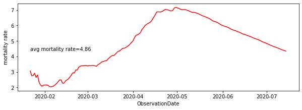

<h1> MY COVID-19 ANALYSIS </h1>
<h2> Covid-19 </h2>

 COVID-19 is a respiratory illness caused by a new virus. It started from Mainland China and later spread around the globe. Symptoms of covid-19 include fever, coughing, sore throat and shortness of breath. The virus can spread from person to person, but good hygiene can prevent infection.

<h3>My Analysis</h3>
I have done a small analysis of covid-19 outbreak and visualized no of cases, growth rate, top affected countries, mortality rate and other important aspects.
This analysis is done on <a href="https://www.kaggle.com/sudalairajkumar/novel-corona-virus-2019-dataset">Novel corona virus dataset</a>. I have studied cases detected till 14/07/2020 for my analysis.

<h3>BASIC INFORMATION</h3>
Total no of countries/Regions with corona cases:  223  
Total Number of Confirmed cases around the world:  13323530  
Total Number of Recovered cases around the world:  7399310 
Total Number of Death cases around the world:  578628 
Total number of active cases in the world:  5345592 
Avg number of confirmed cases per day:  76134 
Avg number of recovered cases per day:  42281 
Avg number of deaths per day:  3306 
Approximate number of confirmed cases per hour:  3172 
Approximate number of Recovered cases per hour:  1761 
Approximate number of Deaths per hour:  137 
Total no of recovered cases in last 1 day: 141941 
Total no of confirmed cases in last 1 day: 219139 
Total no of deaths in last 1 day: 5625 

<h3> CASES WORLDWIDE </h3>
<h4>Total no of confirmed cases all over the world over time.</h4>

<h4>Total no of recovered cases all over the world over time.</h4>

<h4>Total no of death cases all over the world over time.</h4>

<h4>Total no of active cases all over the world.</h4>

<h4> From the plots it is clear that there's still no flattening in the no of corona cases </h4>

  
<h3> INCREASE IN CASES OVER WEEKS </h3>

<h4>Total no of confirmed cases per week</h4>

<h4>Total no of recovered cases per week</h4>

<h4>Total no of deaths cases per week</h4>

<h3> GROWTH RATE </h3>

Avg growth factor of no of confirmed cases: 1.0638799794321891 
Avg growth factor of no of recovered cases: 1.0787552278785428 
Avg growth factor of no of death cases: 1.065448581312955 
<h3> RECOVERY RATE </h3>

<h3> MORTALITY RATE</h3>

<h3> TOP 15 COUNTRIES IN TERMS OF CONFIRMED, RECOVERED AND DEATH CASES</h3>

<h3>TIME TAKEN IN DOUBLING OF CASES</h3>

